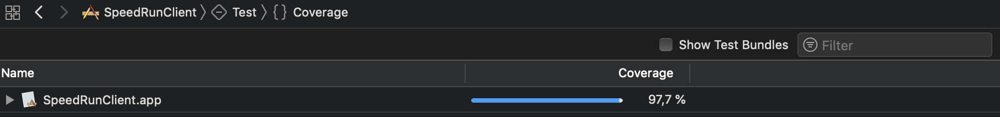

# Build Status #

 | MASTER 
 
 | DEVELOP 

# KEY FEATURES #

- Developed using MVVM
- Code Coverage: 97,7%

- Unitary Test, Functional Test and UITest.
- Added to a Bitrise CI where all the test runs before all the MR (https://app.bitrise.io/app/e806d5aeebebbe0b)

# PROJECT COMPATIBILITY #
- Xcode 12.
- iOS 12
- Cocoapod.

## External dependencies ##
1. [<b>Alamofire</b>](https://github.com/Alamofire/Alamofire) 
1. [<b>JustHUD</b>](https://github.com/shubh10/JustHUD)
1. [<b>SDWebImage</b>](https://github.com/SDWebImage/SDWebImage)
1. [<b>Mockingjay</b>](https://github.com/kylef/Mockingjay
) 
